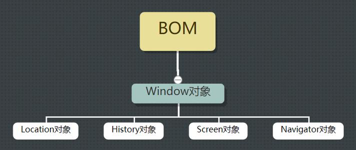
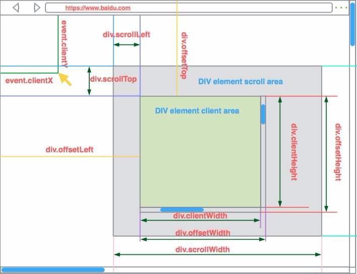
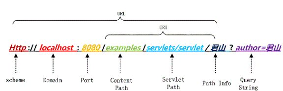

# BOM

## BOM简介

- **什么是BOM**:BOM(Broswer Object Model):浏览器对象模型，是来描述浏览器对象之间的层次关系的模型，每个浏览器都有各自的BOM实现，我们用BOM的API来完成浏览器的各种操作

- **BOM组成**:BOM最大的对象是window，里面存放了其他多个对象

  <!--more-->

  核心 1. 

  

  1. Location对象：地址对象，存放当前访问的url信息

  2. Navigator对象：浏览器对象，存放当前浏览器的一些基础信息

  3. Screen对象：屏幕对象，存放当前浏览器页面屏幕的信息

  4. history:历史对象，存放浏览器访问页面历史信息

## window自带属性和事件

- ### 加载(window.onload)

  页面所有内容加载完成之后执行加载

  **与DOMContentLoader的区别**

  ​	window.onload需要等页面所有内容加载完成后再执行，DOMContentLoader只需要dom对象加载完成后	即可执行

- ### 窗口变化(window.reseize)

  窗口页面大小发生变化

  innerWidth:浏览器宽度

  innerHeight：浏览器高度

- ### 定时器(window.setTimeout/window.setInterval)

  - setTimeout(fn,times)
    - fn：定时器执行函数
    - times：定时器延迟时间(毫秒)
  - setInterval(fn,times)
  - 异同
    - 同：
      1. 参数内容和意义相同，延时器单位都是毫秒返回定时器的特殊id
      2. 都需要清除定时器
      3. times都有一个最小间隔时间，不能真的设置为0。H5中为4ms
      4. 都是宏任务，属于异步操作
    - 异
      1. setTimeout延迟执行一次，setInterval间隔执行

- ### offset、client、scroll

  > 所有系列的内容都是值没有单位的，且都是**只读**的

  

  #### offset(元素偏移量)

  > 获取当前元素距离第一个带有定位的父元素的位置

  - **offsetTop/offsetLeft**：相对于第一个带有定位的父元素上/左边框方偏移量
  - **offsetWidth/offsetHeight**：返回元素的宽/高(包含元素所有的margin，padding，content的总和)

  #### client(可视区偏移)

  > 获取当前元素距离页面左上角(**document**)的位置偏移

  - **clientTop/clientLeft**：相对于第一个带有定位的父元素上/左边框方偏移量
  - **clientWidth/clientHeight**：返回当前元素的宽/高(包含元素padding，content的总和**不包含margin**)

  #### scroll(实际内容)

  > 获取当前元素距离实际内容

  - **scrollTop/scrollLeft**：被卷去的内容距离容器上/左边框偏移量
  - **clientWidth/clientHeight**：返回当前元素的实际宽/高(**只包含内容**)

  #### 页面整体滚动

  - **pageXOffset**： 返回当前页面相对于窗口显示区左上角的 X 位置。 
  
  - **pageYOffset** ：返回当前页面相对于窗口显示区左上角的 Y 位置。 

### this

#### 什么是this

`this`在js中是一个关键字，是一个指针，指向我们调用函数的对象。

#### 执行上下文

 执行上下文 是语言规范中的一个概念，大致等同于函数的执行“环境”。具体的有：变量作用域（和 *作用域链条*，闭包里面来自外部作用域的变量），函数参数，以及 `this` 对象的值。

#### this指向

1. 在全局作用域或者普通函数中使用时指向的是全局对象(window)
2. 在方法中谁调用this就指向谁(全局方法的this指向window，setTimeout=>window.setTimeout)
3. 在构造函数中this指向构造函数的实例
4. 箭头函数本身没有this对象，函数中this就是父级函数中的this

##### 修改this指向

> 调用函数时通过以下方法将执行上下文和对应参数传入，只用传入的指向上下文代替原本的this

1. bind()：不需要执行函数就可以将 `this` 的值准确设置到你选择的一个对象上。还可以通过逗号隔开传递多个参数，如 `func.bind(this, param1, param2, ...)` 。

2. apply()：将 `this` 的值准确设置到你选择的一个对象上。第二个参数是一个数组，数组的每一项是你希望传递给函数的参数。最后执行函数。

3. call()：将 `this` 的值准确设置到你选择的一个对象上，然后想 `bind` 一样通过逗号分隔传递多个参数给函数。如：`print.call(this, param1, param2, ...)`。最后执行函数。

## window内置对象

#### Location对象

> 用于设置或获取页面的URL，并可以对其解析

#### ** URL**：

#### 同一资源定位符，是互联网上标准资源的地址

**url组成**：

- protocol/schemel 协议，常用的协议是http
- hostname/Domain 主机地址，可以是域名，也可以是IP地址
- port 端口 http协议默认端口是：80端口，如果不写默认就是:80端口
- path 路径 网络资源在服务器中的指定路径
- parameter 参数 如果要向服务器传入参数，在这部分输入
- query 查询字符串 如果需要从服务器那里查询内容，在这里编辑
- fragment 片段 网页中可能会分为不同的片段，如果想访问网页后直接到达指定位置，可以在这部分设置

#### Location 属性

- hash：保存当前url中的哈希值（url中#号后面的任意个字符），url中不包含哈希值        则返回空串

- host：保存当前url中的域名和端口号

- href：获取当前页面所有地址

- pathName：保存当前url中路径或者文件名

- port：保存当前url中的端口号

- protocol：保存当前url使用的协议

- search：保存url中的查询字符串(?xxx)

- assign(url):导航到参数url位置并生成一条历史记录（等同与 location.href=url， window.localtion=url)

- replace(url):导航到参数rul位置但不生成历史记录

- reload(boolean)：重新加载当前文档，传参true表示强制从服务器加载所有资源

### Navigator对象

> 存储了浏览器的对应信息

- userAgent：用户代理字符串，通常用来判断当前使用的是什么浏览器

- plugins：保存安装所有插件信息的数组，用来判断当前用户是否安装了页面所必须的插件，IE无此属性（通过ActiveXobject对象来判断）

### History对象

> 存放当前浏览器浏览历史

length(属性):history对象中的记录总数

方法：

- back()：前往浏览器历史条目中后一个URL，后退

- forward()：前往浏览器历史条目中前一个URL，前进

- go(number)： 可加载历史列表中的某个具体的页面，URL 参数使用的是要访问的 URL，或 URL 的子串。而 number 参数使用的是要访问的 URL 在 History 的 URL 列表中的相对位置。	

## 浏览器存储　　　　

### cookie：

Cookie：是指由服务端生成，发送给客户端（通常是浏览器），为了辨别用户身份、进行session跟踪而储存在用户本地终端上的数据（通常经过加密）

**问题**：

1. Cookie会被附加在每个HTTP请求中，所以无形中增加了流量。

2. 由于在HTTP请求中的Cookie是明文传递的，所以安全性成问题。（除非用HTTPS）
3. Cookie的大小限制在4KB左右。对于复杂的存储需求来说是不够用的。

### session：

Session：由服务端生成，保存在服务器的内存、缓存、硬盘或数据库中的用对象来存储特定用户会话所需的信息。

**问题**：

1. session会在一定时间内保存在服务器上，当访问增多，会比较占用服务器的性能

2. session不能区分路径，同一个用户在访问一个网站期间，所有的session在任何一个地方都可以访问到

## WebStorage（localStorage/sessionStorage)

Web Storage的概念和cookie相似，区别是它是为了更大容量存储设计的(5M),以键值对的形式存储数据，并提供了一系列操作数据的方法

**方法**：

**xxx.setItem(key,value),xxx.getItem(key)**：获取/设置WebStorage中的值

**xxx.removeItem(key)**:删除WebStorage的key以及key对应的value

**xxx.clear()**:清空WebStorage中的所有内容

三者的区别

| 特性           | Cookie                                                       | localStorage                                                | sessionStorage                                              |
| :------------- | :----------------------------------------------------------- | :---------------------------------------------------------- | :---------------------------------------------------------- |
| 数据的生命期   | 可设置失效时间，默认是关闭浏览器后失效                       | 除非被清除，否则永久保存                                    | 仅在当前会话下有效，关闭页面或浏览器后被清除                |
| 存放数据大小   | 4K左右                                                       | 一般为5MB                                                   | 一般为5MB                                                   |
| 与服务器端通信 | 每次都会携带在HTTP头中，如果使用cookie保存过多数据会带来性能问题 | 仅在客户端（即浏览器）中保存，不参与和服务器的通信          | 仅在客户端（即浏览器）中保存，不参与和服务器的通信          |
| 易用性         | 需要程序员自己封装，源生的Cookie接口不友好                   | 源生接口可以接受，亦可再次封装来对Object和Array有更好的支持 | 源生接口可以接受，亦可再次封装来对Object和Array有更好的支持 |