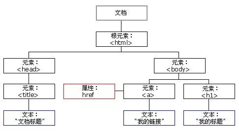

# DOM

## DOM简介

- **什么是DOM**:DOM(Document Object Model):文档对象模型，它是由W3C推荐的处理可扩展标记语言(XML,HTML)的标准**编程接口**。

- **DOM组成**:DOM被W3C分成了三个部分/层级

  1. 核心 DOM 用于任何结构化文档的标准模型
  2. XML DOM 用于 XML 文档的标准模型
  3. HTML DOM用于 HTML 文档的标准模型

  > 本文记录的均是HTML的DOM标准

<!--more-->

## DOM组成

> 在浏览器中每一个页面加载都会被转化成一个文档对象(document),页面上的所有展示内容都由该文档按照层级解析而来这种结构关系也叫做DOM树(DOM数据结构)



- 文档：每一个页面就是一个文档，DOM中用document表示，包含了该页面的所有内容
- 元素：页面中的有标签，用element表示
- 节点：网页汇总的所有内容区块(标签，属性，注释等)，用node表示
- 事件：页面中发生的所有不同的具有交互效果的行为(点击，键盘输入)等

> 以上四个内容都可以当做对象来看，也就是常说的组成DOM四大对象

## 页面中的Document和Element对象

- **获取节点** *页面中document，element都提供了来对页面中的元素进行一系列的操作包括(获取、增加、删除等)*
  - 获取页面元素getELementByxxx
    - 通过id获取`getELementById(‘id’)`内容是大小写敏感的字符串，下同，返回一个符合要求的元素对象
    - 通过className获取`getELementByClassName(‘className’)`返回符合要求的伪数组
    - 通过标签名获取`getELementByTagName(‘tag’)`返回符合要求的伪数组
    - 通过选择器获取`querySelector(选择器)`返回第一个符合要求元素对象，`querySelectorAll(选择器)`返回所有符合要求元素对象集合

  - 获取页面中的body和html
    - body：`document.body`
    - html：`document.documentElement`

### Dom节点操作

- 操作节点的两种方式
  - Attribute：用getAttribute来获取特殊的属性值，用setAttribute来设置元素属性，removeAttribute删除属性(可以增删取原本元素不存在的属性即自定义属性)，修改的是对应标签内容
  - Prototype：用js的方式获取元素自带属性(width,id等)，直接用element.xx获取，修改的是节点的js对象

- 节点操作的API

  - 创建元素:
    - document.write
    - innerHTML
    - createElement
  - 插入：xx.appendChild(节点)在后面追加节点 xx.insertBefore在前面插入节点
  - 获取父元素：xx.parentNode
  - 获取子元素：xx.childNodes/xx.children
  - 获取第一个和最后一个子元素：
    - xx.firstChild/xx.lastChild:返回对应节点可能会包含文本节点
    - xx.firstElementChild/xx.lastElementChild

  - 获取上一个和下一个兄弟节点：xx.perviousSibling/xx.nextSibling

### DOM性能优化

- 缓存DOM：将需要频繁获取内容先用对象缓存起来，使用时直接使用对象

- 合并操作：将频繁操作合并成一次性操作

  ```js
  //假设向页面的ul中插入100个li
  const listNode=document.getElementById('list')
  /*
  传统方法
  引发了100次的DOM重新渲染
  */
  for(let i=0;i<100;i++){
      let li=document.creatElement('li')
      li.innerElement=`List item ${i}`
      listNode.appendChild(li)
  }
  /*
  改进方法 创建一个代码片段
  */
  //创建一个代码片段 这是一个游离的区域并不在DOM中
  let freg=document.creatDocumentFragment()
  for(let i=0;i<100;i++){
      let li=document.creatElement('li')
      li.innerElement=`List item ${i}`
      freg.appendChild(li)
      // 将所有操作都缓存进该区域
  }
  //真正执行插入操作，只引发1次DOM重新渲染
  listNode.appendChild(frag)
  ```

## 事件

### 事件要素

1. 事件源：事件触发对象

 	2. 事件类型：事件交互类型
 	3. 事件处理函数：事件处理程序

### 事件注册

#### 传统方式

- 方式：事件源.onXxx/` <button onClick='xxx'>`
- 事件唯一，前面事件函数会被覆盖注册的事件函数所覆盖，只会执行最后一次注册的函数

#### 方法监听

- 方式：xxx.addEventListener(type,listener,useCapture)
  - type:事件类型的字符串，click，mousemove等
  - listener：事件处理函数
  - useCapture(可选，默认false)：事件触发方式true捕获阶段触发，false事件冒泡阶段触发

- 事件不唯一，按照事件注册顺序执行

### 事件删除

#### 传统

xxx.onXXX=null

#### 方法监听

xxx.removeEventListener(type,function)

- type:：类型
- function：处理事件名称

### 事件流

> 事件流是描述页面接收事件的顺序，当事件发生时会在元素节点之间按照特定的顺序传播，这个过程叫DOM事件流

#### 事件流过程


1. 捕获阶段：从最外层document阶段开始向子节点依次传递事件
2. 当前目标阶段：触发事件的最具体元素
3. 冒泡阶段：从最开始触发事件的那个元素开始向父元素依次传播事件

#### 事件对象(event)

> 每一个事件上注册的函数都会带有一个默认的参数，里面包含了该事件一系列的相关内容

- e.target:最初始事件触发的对象
- e.type:事件的类型
- e.preventDefault：阻止默认事件
- e.stopPropagation:阻止事件冒泡
- e.currentTarget:当前绑定的捕获事件对象

#### 事件委托(事件代理)

> 利用事件的冒泡机制将众多相同内容不同数据的子元素处理事件移植到父元素中，在父元素中进行统一处理

```html
<body>
    <ul id="ul">
        <li>1</li>
        <li>2</li>
        <li>3</li>
        <li>4</li>
    </ul>
    <script>
        //在一个ul中每次点击li获取对应的数据
        /*
        传统方式给每一个li绑定事件
        */
        const li = document.getElementsByTagName('li')
        for (const i of li) {
            i.onclick = function (e) {
                if (e.target.nodeName === 'LI') {
                    alert(e.target.innerText)
                }
            }
        };
        //事件委托 通过冒泡机制在父元素节点ul中统一处理
        const ul = document.getElementById('ul');
        ul.onclick = function (e) {
            if (e.target.nodeName === 'LI') {
                alert(e.target.innerText)
            }
        }
    </script>
</body>
```

