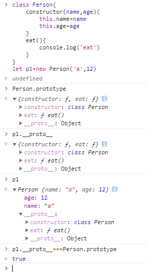

对象、原型、继承/web.png)

# 对象

> 用来描述一系列的特征(属性)和方法(行为)的无序集合称为对象

## 创建对象

### 字面量创建对象

- 创建：`let obj={name:'a',eat(){console.log('eat')}}`在`{}`之间的所有内容都属于obj这个对象，存放变量，函数等以键值对的形式存在
- 调用：
  - 属性调用：1.`obj.xxx`2.`obj[xxx]`
  - 方法调用`obj.xxx`

### new关键字创建对象 

- 创建 `let obj=new Object(),obj.name='1' `
- 调用：同字面量

<!-- more -->

### 构造函数创建对象

> 将多个对象公共的属性和方法抽象出来并封装到一个特殊的函数中，这个函数就叫做构造函数

- 创建：

  ```js
  function Object(arguments){
      this.属性=属性值
      this.方法=方法
  }
  ```

- 调用

  ```js
  function Person(name,age){
      this.name=name
      this.age=age
  }
  Person.prototype.eat=funnction (){
      console.log('eat')
  }
  var p1=new Person('a',10)
  //创建了一个名为p1的对象，创建时将特定的参数化传递到构造函数通过new关键词即可创建一个特殊对象
  ```

- 构造函数和对象区别
  - 构造函数：一个概念，只存放了一系列的抽象的属性和行为的结合
  - 对象：一个具体的事务，有具体的属性和行为，是构造函数的一个实例

### class创建对象

> 用class创建对象 实际上就是构造函数创建，以往构造函数的赋值操作变成了constructor里面，挂载在其原型上的方法可以直接写在构造函数外面，所以class只是一个让构造函数更加清晰，可读性更强的语法糖而已

- 创建

  ```js
  class Person{
      constructor(name,age){
          this.name=name
          this.age=age
      }
      eat(){
          console.log('eat')
      }
  }
  ```

- 调用(和构造函数使用类似)

  ``` js
  let p1=new Person('a',12)
  p1.name///a
  ```

### new 如何创建了一个新对象

1. 开辟出一个新的内存空间(创建一个空对象)

2. 将构造函数的显式原型赋值到实例对象的隐式原型中

3. 将构造函数的this指向到新对象

4. 执行构造函数完成对应操作

5. 返回新对象

   ```js
   let p1=new Person('a')//相当于
   //let p1 //创建一个
   let p1=(function(){
       let newP1={}
       newP1._proto_=Person.prototype//获取原型
      Person.call(newP1,'a')//把当前this传入，并执行构造函数
       return newP1 //返回新对象
   }()
   
   ```

## 原型和原型链

### 原型

#### 什么是原型

在创建每一个构造函数时我们会定义一系列的公共属性和方法，一个构造函数可以创建N个具有不同内容的对象(实例),但每所有的实例都会具有构造函数所定义的公共属性和方法，这些共有的属性和方法就称之为原型

#### 显式原型和隐式原型

先看以下例子



在Person类中存在`prototype`属性该属性就是Person的原型，存放了它自己特有的属性和方法。在Person的实例p1中存在`_proto_`属性，该属性指向了p1的构造函数也就是Person的原型`prototype`，一般的我们将构造函数中的原型`prototype`称之为显式原型，将实例中的`_proto_`称之为隐式原型

#### 原型链

由上述我们可以知道一下三点

1. 每一个class(构造函数)都有显式原型`prototype`
2. 每一个实例对象都有隐式原型`_proto_`
3. 实例中的隐式原型指向其构造函数的显示原型

再看以下例子

对象、原型、继承/原型链.PNG)

> 我们调用p1的toString方法，但实例当中没有，去构造函数中查找也没有，再去Person的构造函数Object查找找到了该方法于是调用Object.toString方法。

一般的当我们调用某一个属性或者方法的时候，js会先从当前实例当中查找方法找到调用，找不到通过`_proto_`查找其构造函数的方法和属性(因为实例的`_proto_`指向其构造函数的`prototype`)，若找不到则通过`_proto_`查找再构造函数的构造函数的方法和属性一直到最外一层位置(Object) 这种层层传递的这种链式结构就叫做原型链

## 继承

> 在外面创建实例时，会需要创建属性和实例，而某些属性和实例可能已经被自己或者前人实现过，如果能通过每种方式将那些前人写好的东西继承过来的话会让我们的程序简洁很多。

### 类式继承

- 方法：直接将子类原型指向父类

  ```js
  function A(name){
      this.name=name;
      this.list=[1,2,3];
  }
  A.prototype.getName=function(){console.log(this.name)}
  function SubA(name){
      this.subName='sub'+this.name
  }
  SubA.prototype=new A()
  ```

- 问题：

  对象、原型、继承/类式继承.PNG)

  由图可知

  1. 该方式不会支持父类构造函数A有参数的情况
  2. 该方式会把父类的所有内容继承下来哪怕是父类不希望传递的属性list

- 原因：由于通过这个语句`SubA.prototype=new A()`我们获得了A的一个实例，但是在这个new的时候由于类本身也是个抽象概念，不知道具体实例所以当我们执行A构造函数的时候我们并不知道要给A的构造函数传什么值所以`this.name=undefined`，(问题1)且我们new A的时候把A的所有属性和原型都指向了`prototype`所以A中的所有属性方法 对象都会被传递(问题2)

### 组合继承

- 方法：在继承时执行父类的构造函数方法

  ```js
  function A(name){
      this.name=name;
      this.list=[1,2,3];
  }
  A.prototype.getName=function(){console.log(this.name)}
  function SubA(name){
      A.call(this,name);
      this.subName='sub'+this.name;
  }
  
  ```

- 问题：

  对象、原型、继承/构造函数继承.PNG)

  由图可知

  1. 该方式无法获得父类的prototype上的属性

- 原因：当我们执行new SubA的时候`A.call...`会执行，因此会把name和list拿过来赋值给当前的this也就是SubA但是由于只执行了这一个方法就仅仅相当执行了赋值操作，对父类原型和原型链上的内容无任何处理

### 组合继承

- 方法：类式继承+构造函数继承

  ```js
  function A(name){
      this.name=name;
      this.list=[1,2,3];
  }
  A.prototype.getName=function(){console.log(this.name)}
  function SubA(name){
      A.call(this,name);
      this.subName='sub'+this.name;
  }
  SubA.prototype=new A()
  ```

- 问题：

  对象、原型、继承/组合式继承.PNG)

  由图可知

  1. 会继承一堆没有用的函数和属性

- 原因：当我们执行new SubA中A.call...`会执行，因此会把name和list拿过来赋值给当前的this也就是SubA，在外面newA的时候又把A中的属性拿了过来

### 寄生式组合继承

- 方法：在组合继承的基础上寻找一个干净的中间量只继承原型(寄生)

  ```js
  function A(name){
      this.name=name;
      this.list=[1,2,3];
  }
  A.prototype.getName=function(){console.log(this.name)}
  function SubA(name){
      A.call(this,name);
      this.subName='sub'+this.name;
  }
  //SubA.prototype=new A()改造成=>
  function inhertPrototype(subClass,superClass){
      function whippingBoy(){};//被寄生函数
      whippingBoy.prototype=superClass.prototype;
      subClass.prototype=new whippingBoy();
  }
  inhertPrototype(SubA,A);
  ```

- 问题：

  对象、原型、继承/构造函数继承.PNG)

  由图可知

  1. 该方式无法获得父类的prototype上的属性

- 原因：当我们执行new SubA的时候`A.call...`会执行，因此会把name和list拿过来赋值给当前的this也就是SubA但是由于只执行了这一个方法就仅仅相当执行了赋值操作，对父类原型和原型链上的内容无任何处理

### 组合继承

- 方法：类式继承+构造函数继承

  ```js
  function A(name){
      this.name=name;
      this.list=[1,2,3];
  }
  A.prototype.getName=function(){console.log(this.name)}
  function SubA(name){
      A.call(this,name);
      this.subName='sub'+this.name;
  }
  SubA.prototype=new A()
  ```

- 结果

对象、原型、继承/寄生.PNG)

