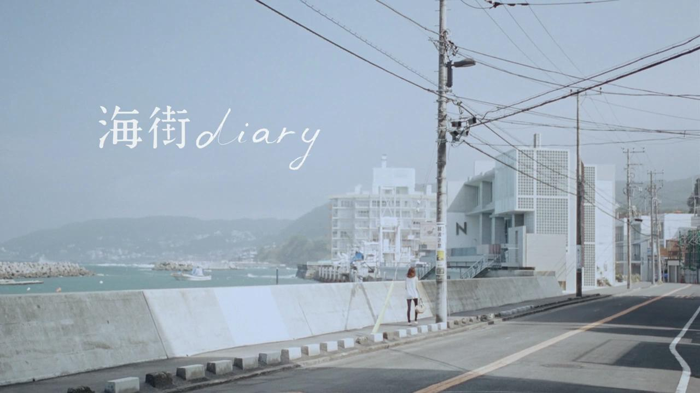
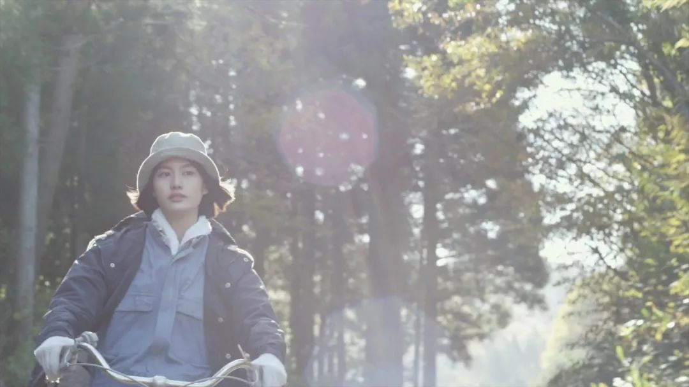
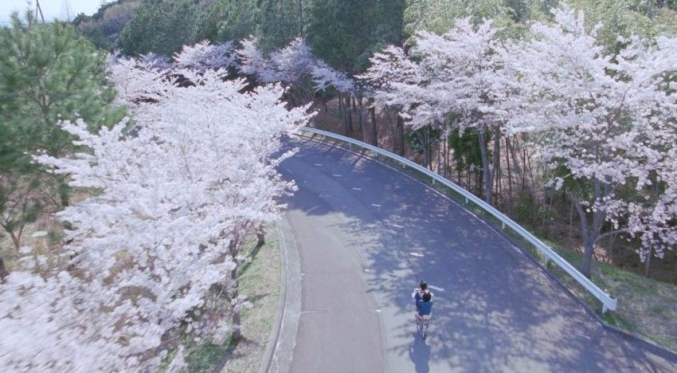
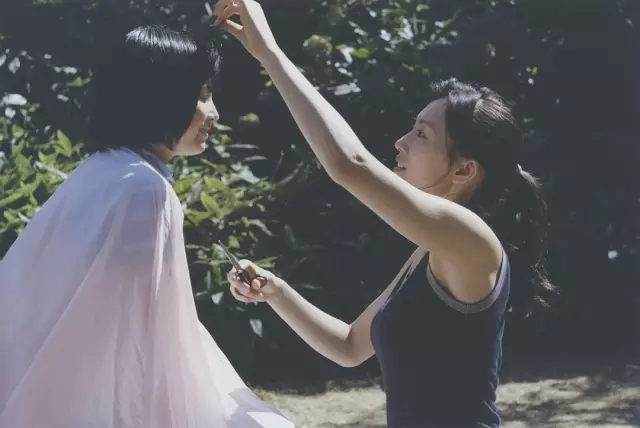
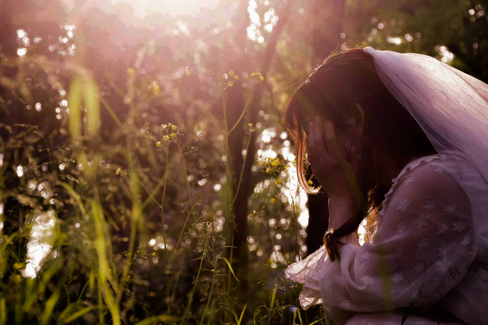
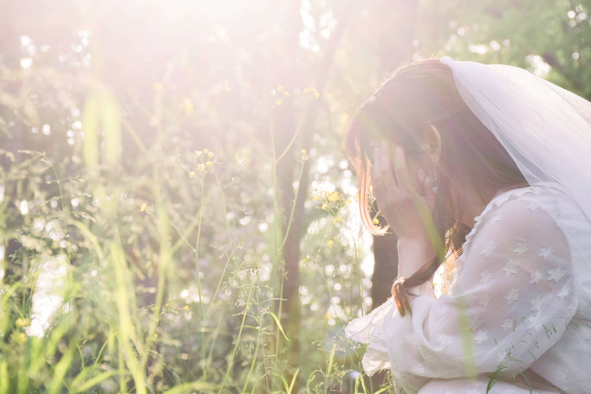
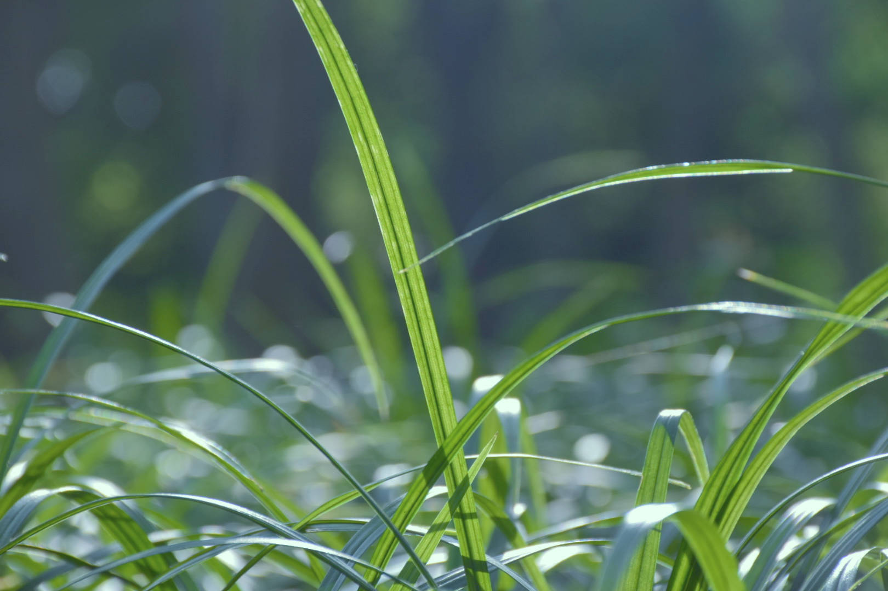

# 日系风格拍摄思路

最近开始尝试拍摄日系风格，看了网上很多文章，之后在拍摄和后期的过程中自己也在不断的改进慢慢的有了一些浅薄的理解，但基于每个人摄影的风格，采用的手法，照片的构图等等都不一样。具体操作参数并没有普遍意义，所以我只写总体思路，这样应用场景能广泛些。

## 什么是日系风格

我所理解的日系风格简单来说就是从小到大接触的日本的动漫，电影，插画等等这里选取几部我很喜欢的日系电影《海街日记》《小森林》来说明

先看看不同手法的剧照和巨巨巨想去的镰仓

<em>《海街日记》</em>

<!--more-->

<em>《小森林·冬春》</em>

<em>《海街日记》--樱花</em>

<em>《海街日记》--小家</em>

日系风格的电影和照片总是给人一种治愈，温暖，简单的情绪，而这种来自于**真实和谐的照片内容结构+整体相似的色彩渲染的氛围**

#### 内容结构

在以上的例子中有冷暖色调和高低色温,但他们的场景都有一个共通点——简单，不管是街景，樱花，树林还是院落都是我们生活中常见的景象，不需要特殊的构图，线条，力求真实，看起来就像是我们生活中不经意的瞬间

#### 色彩

真实简单的场景仅能够有代入感但这远不足够，还需要色彩来调整照片的重点和加强氛围借此来表达出情绪,个人认为这一类清新的日系所追求的目标应该是照片所有内容共同构建出来的氛围，所以我们应当让整体和谐，削弱突出的细节，把看者注意力转移整体的情景中。在大部分情况下降低对比度都是一个必要的选择。

## 日系风格的取景

这一类的日系取景的整体思路,就是雨露均沾。在拍摄前最好在脑海中先构建出你需要拍摄的大概情景或者想要的效果，再根据效果和实际场景去取景。这部分除了丰富的想象力之外我觉着多看这一类的电(强推是枝裕和，总是在看似无趣的日常里面表达出轻微但是稠密且绵长的情感。非常nice~)或者多看类似的图片会好一些，画面主体内容上结构比例和谐即可但最好不要出现过于突出的主体.

如果是有人像参与，最好让人像成为景中的一部分，穿着上也尽量素一些，太过花哨的着装会浪费多余的注意力，破坏整体的情境，着装的色调也最好和整体环境的色调贴近，不好选的话中性色调是个不错的选择。

## 日系风格的后期调色

原片完成之后，后期调色也是渲染氛围的重要一步，在整体色调上尽量以主体环境颜色以基准或者以你提前想好的效果为准(但是一定要偏色)，照片整体的色温贴近而色调需要取决于画面的主体和颜色的通透情况而定，在大多数情况下需要降低对比度，提高曝光。

## 样例

下面也选了两张我自己拍摄的，第二章由于原片被我删了所以只讲一下我第一张的调色思路，以下是原图

这一张拍摄前我提前想好了想要一种夏日林间少女感觉，所以采用的是逆光手法+大光圈拍摄，当时拍摄的时间是四五点的公园树林里，照片主体偏黄，所以整体风格选都尽量靠近暖色上面靠近，且能观察到画面上除余阳光直射的部分外其他部分都偏暗。

小清新类的日系照片通透性都非常好，而我们首先要做的就是让画面看起来干净，整体性强一些。先降低对比度增强整体性，其次增加曝光和亮度来进一步削弱带来的影响消除影响，增加通透性。

画面干净之后我们需要做的就是调整色温和色调，制造偏色来营造我们想要的效果，已经说过我们主体选用的是暖色调，所以我们需要画面看起来干净温暖，调高色温降低色调让整体画面去贴近暖色，同时也要适当调整饱和度，让画面整体颜色结构合理。

再后就是做一些微小的细节处理，增加阴影亮度，黑白色阶，高光，降低清晰度等等去贴近我们想要的效果。

第二掌拍摄的时候并没有想好，只是拍摄第一张的过程中偶然拍摄的，所以整体效果是后期自己决定的，主题颜色是绿色，所以整体颜色也向中性偏冷靠近，这张拍摄的时候就很亮了，取景布局也很好，不需要改动结果只需要简单的增加绿色明度，纯度去增强画面主体(由于是近景所以画面整体性和谐就略等于主体+背景)，略微增加高光阴影，降低黑色色阶，增加背景和主体的对比。最后略微降低色温和色调，制造偏色即可。

