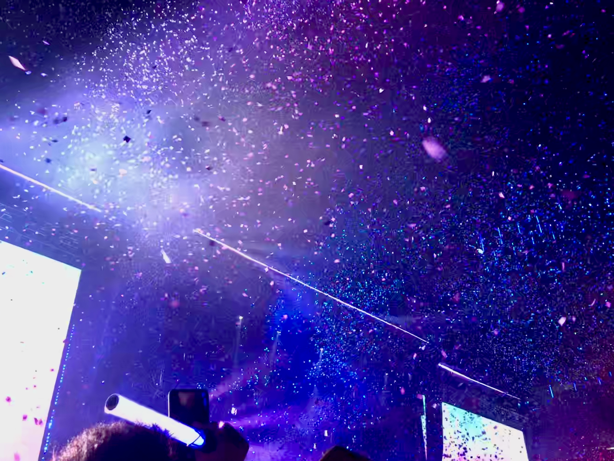
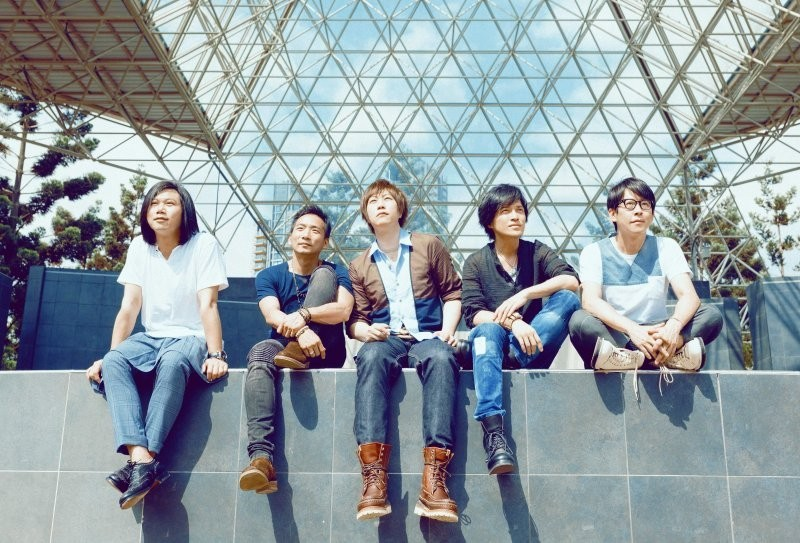
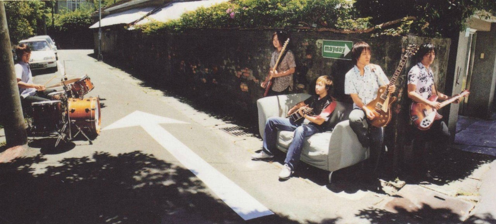
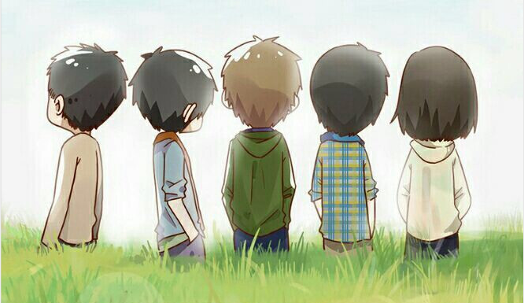
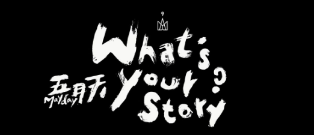

## 青春向左

<em>——记五月天上海演唱会和零碎的情绪</em></right>

#### 一次久别重逢

2019年11月1日 ，上海虹桥体育场。

18：40

演唱会七点开始,我坐在座位上一边听着告五人的热场一边和有事没来的朋友发着消息，时不时听到周围略显兴奋的谈论和打闹，大家都在共同的期待着什么。

19：00

吵闹中灯光突然暗了下来，两秒中的停顿之后，耳边响起了熟悉的音乐，大家都兴奋的叫了起来。看着期待中的身影渐渐出现，我心里突然有些复杂的情绪交错在一起，既有看到他们的兴奋，也有对演唱会的期待，还有一种难以言说的感慨，就像是久别的老友，大家经历着各自的人生，有着不同的际遇，但在一个阳光昏黄温暖的傍晚，在一个临街的咖啡厅里大家又坐在了一起，相视一笑

嘿，你们...

好久不见

22：00

随着最后的鞠躬和致谢，演唱会还是结束了，我站起身不紧不慢的走向出口，看着三三两两走过的身影想着他们中或千里迢迢或省吃俭用都只为了加入一场三四个小时的聚会，和周围的人一起，听着五月天的歌声然后回忆着各自的故事。临到出口的时候，我转过头再看了一眼舞台，想起阿信最后疲惫的样子和有些沙哑的声音，有些心疼

原来

五月天也二十岁了

#### 五月天的故事

**我们是！五月天**

1997年，破蛋的五月天和二十岁的团员们像所有的年轻人一样，有无数多的困惑，迷茫和悲伤

嘴上说着爱情万岁但歌词里面尽是一夜欢愉

想要对你温柔但最后还是决定还你自由

以为爱情纯真但怎么故事三个人

也像所有的年轻人一样，哭完了丧完了再起来战斗，去干翻这个操蛋的世界

不知道明天在哪未来何去，反正人生海海，潮落之后一定有潮起

故事落尽孤独一人，就别埋头吃饭让我们一起终结孤单

在世界尽头无人记得但感动永远在，再吃一颗苹果吧

他们是五月天，也是五个不知所措，迷茫又满是憧憬的年轻人，如果能坐着时光机去二十岁的他们的话，我想，会得到和我们一样回答......

未来怎样？

不知道呢

所以，然后呢？

一起走吧

**苍狗白云**

2017年，这一年五月天二十岁了，团员们也年过四十。一年前出了第九章专辑——《自传》，听完专辑之后有人说五月天变了少了活力，青春和梦想，不如蓝三，你们的热血呢？不甘呢？奋斗呢？你们可是五月天啊！

如果二十年前的五月天听到小九的时候可能也会是这种感觉吧，这张专辑里面充满了回忆，释然和告别。好像和我们记忆中的五月天背道而驰，他们变了吗？

我想是的。但我很喜欢，因为一首歌曲一张专辑本就是他们自己人生的剪影和思绪的结晶，二十年了，他们经历过为梦想奔走的疲惫和迷茫，因为服役带来的离散和不安，获奖但是不被认可的苦涩和委屈，也有鸟巢的十万人演唱会，妻女家人的温馨，终于获得的最佳作词人。

人生海海，白云苍狗，他们写了顽固，去感谢那个从不曾放弃的自己。写了转眼去安静释然的回忆过去，准备未来的离别。写了少年他的奇幻漂流描绘人心善恶。写了任意门和兄弟去回忆和感谢二十年一直陪伴的团员。也写了派对动物，人生有限公司对生活的喧闹和反抗。他们其实从不曾放弃朝气和梦想，只是多了对生活的温柔和释然。这是五月天的二十岁，团员们的四十岁，如果这也是我的四十岁，那很让我心向往之。

这是他们的自传

也是我们

后青春期的诗

#### 生活向右

不知道为什么看完演唱会之后时常会多一些无端的情绪，会想起以前经历过的事，曾经并肩的人，那些遗憾和后悔，也会想到现在不安的生活，要到来的离别，一些迷茫和无助。或者是未来的计划，想要去的地方和可能遇见的人，淡淡的憧憬和希望。有时候觉得自己矫情，又有时候自己像个小老头，可能这就是二十岁的我们吧，绝望着迷茫着悲伤有彷徨，但也努力的快乐和憧憬。

整理完所有东西之后，我走到阳台透了一口气。这个时候的小区一片漆黑，看着不远处街边昏黄的路灯，时不时驶过的汽车，还有耳边时不时传来的虫鸣和空气中的淡淡花香。突然有种淡淡的幸福感，我很喜欢这一刻，静谧，美好而永恒。过了一会，一阵凉风吹过。看看手表，凌晨一点了。我走回了房间，把思绪都一一封存起来。因为第二天，要开始了。

青春向左

但

生活向右

